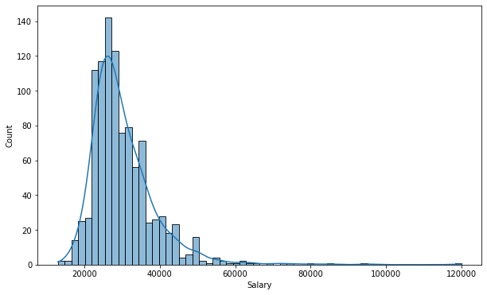
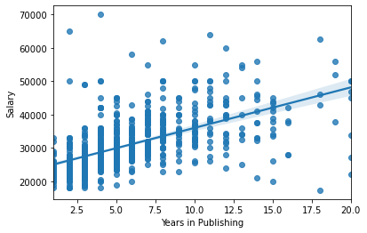
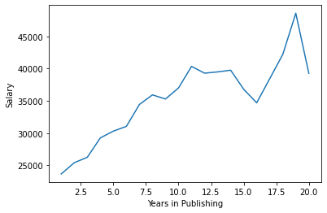
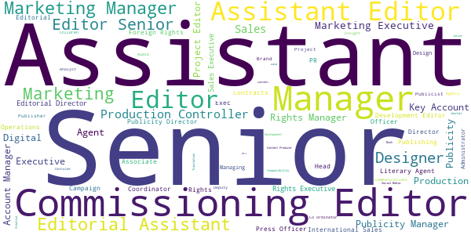

# UK Book Publishing Analysis

## Overview 
Working in publishing is a tough profession and many people who want to work in the industry do not know what salary they can expect when starting out. In this analysis, we will analyse the self-reported salaries of people who work at different levels within the publishing industry in the UK. We will explore patterns in the data and also try to develop a model that we can use to predict salary based on a selected set of features.
 
## Summary of Findings
* On average, the majority of individuals who work in publishing in the UK appear to be straight, white women who occupy full-time positions.  

* Those who had not disclosed their race and ethnicity appeared to have earned the highest salary and worked the longest in publishing.  

* Salary appears to gradually increase as years in publishing increases. However, at around the 13 year mark, salaries vary quite strongly with some individuals receiving a substantially higher salary while the salary of others seems to decrease.  

## Summary Statistics

| Models | Best R² | Best RMSE | Average RMSE After 5-Fold Cross-Validation |
| :- | :-: | :-: | :-: |
| Simple Linear Regression | 38.3% | 6462 | - |
| Multiple Linear Regression | 39.2% | 6165 | 5901 |

## Code and Resources Used 
**Python Version:** 3.8.5  
**Packages:** re, pandas, numpy, matplotlib, seaborn, scikit-learn, statsmodels  
**UK Publishing Dataset:** https://sourceful.co.uk/doc/350/book-publishing-salary-transparency-uk   

## About the Data
In 2017, a campaign was started in order to increase transparency in the UK publishing industry. A survey was conducted of 48 editorial job roles advertised on the Bookseller’s Jobs in Books platform. Just two of the 48 editorial job ads indicated salary or salary bands. In one email listing sent to job-seekers in the Spring of 2020 across all departments and levels, not a single job advert showed salary transparency.

Transparency, especially at entry level, is a crucial part of the wedge, the bigger end result being a more diverse and exciting range of applicants able to weigh up their options about work in the book trade sector, and better able to consider where they might best fit and work well.

To read more about the campaign, visit: https://www.bookjobtransparency.co.uk/

## UK Publishing Dataset Schema After Cleaning and Prep

| Column |
| - |
| Job Title |
| Salary |
| Employment Status |
| Race / Ethnicity |
| Gender Identity |
| Sexual Orientation |
| Years in Publishing |

## EDA
In the EDA, I looked at some of the relationships between the self-reported salaries of individuals working in the publishing industry and features such as years spent in publishing, employment status, race/ethnicity, gender identity and sexual orientation. I also analysed the most popular words from people's job titles.

Below are a few highlights from the analysis. 
  
  
  

  
  
  
